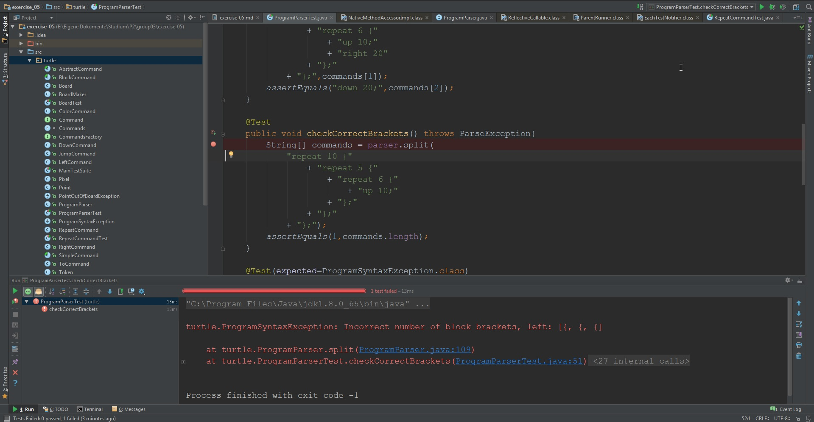
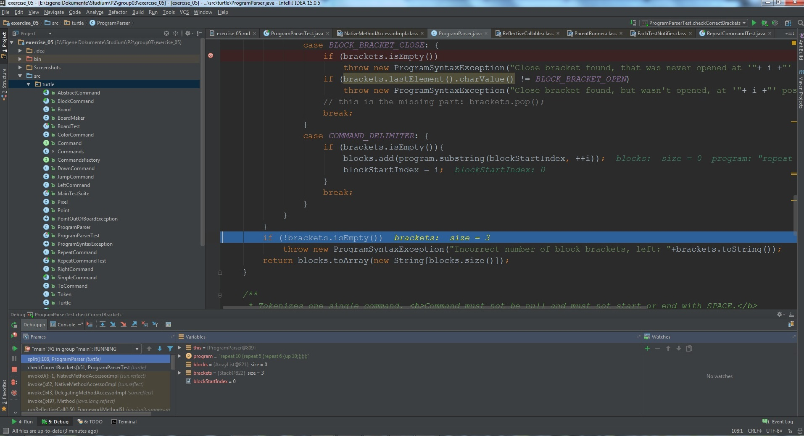
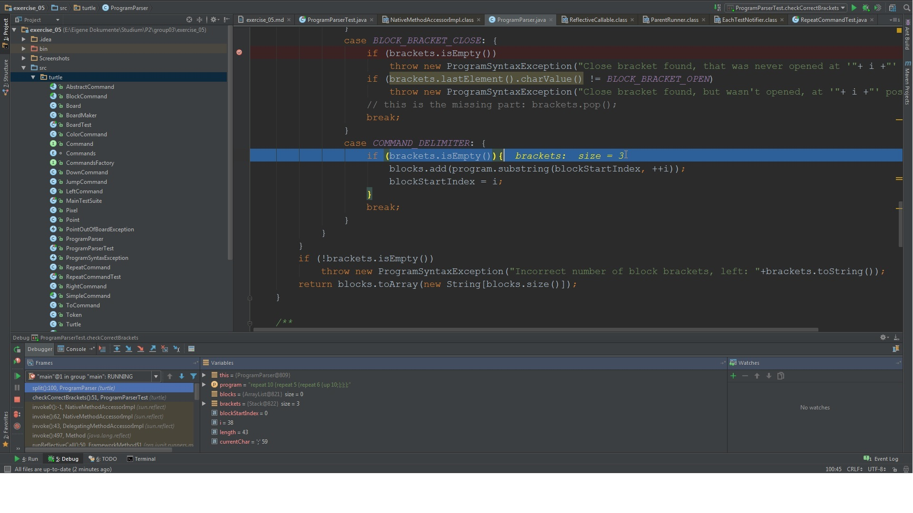
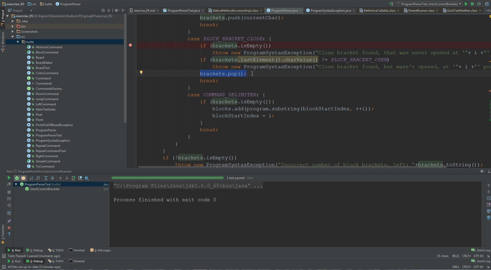
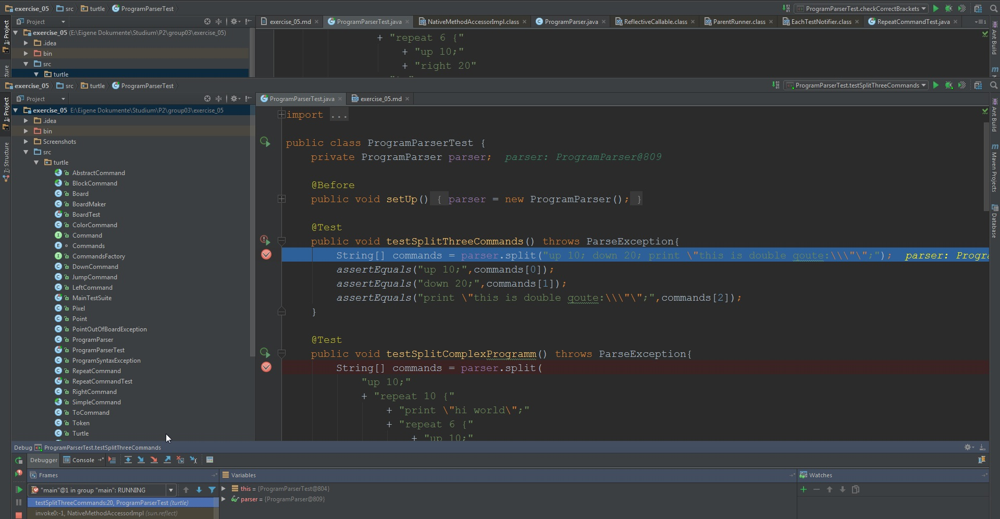

# Exercise 5

These are the required explanations how we used the debugger to fix the bugs.

## First Bug

This bug occurred in the *checkCorrectBrackets()* test method.
First I set a breakpoint before the parse call.

Then I stepped down throw the parse method until I discovered what was throwing the exception.

The problem was that the Stack wasn't popped when the program parsed a correct bracket.

So I fixed it by adding the pop method when a matching bracket is found.

## Second Bug
This bug occurred in the *testSplitThreeCommands()* test method.
Again I first set a breakpoint before the parse method is called

Then same as with first bug i stepped down throw the parse method until I discovered, that
the thrown exception came from a space before the command.

I fixed the bug by pushing the *blockStartIndex* to the first char that is not a space.
