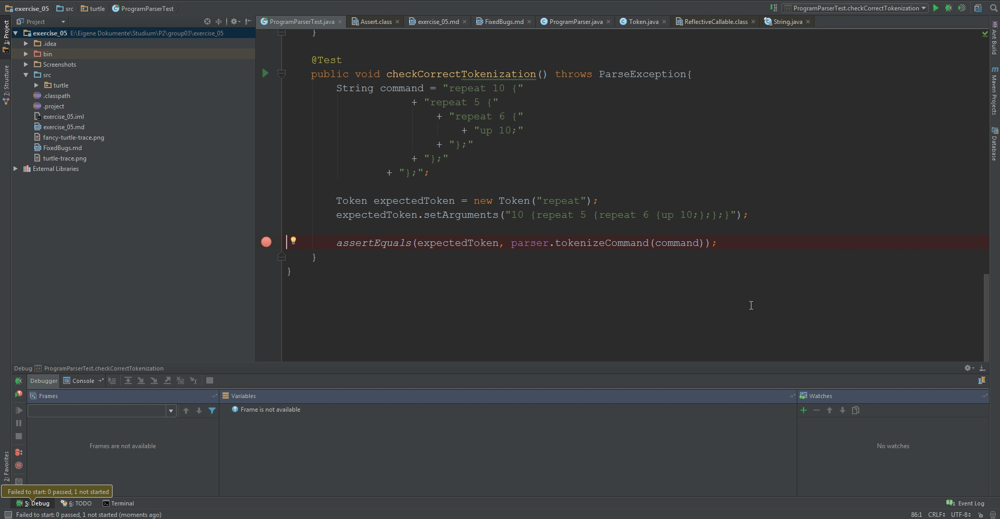
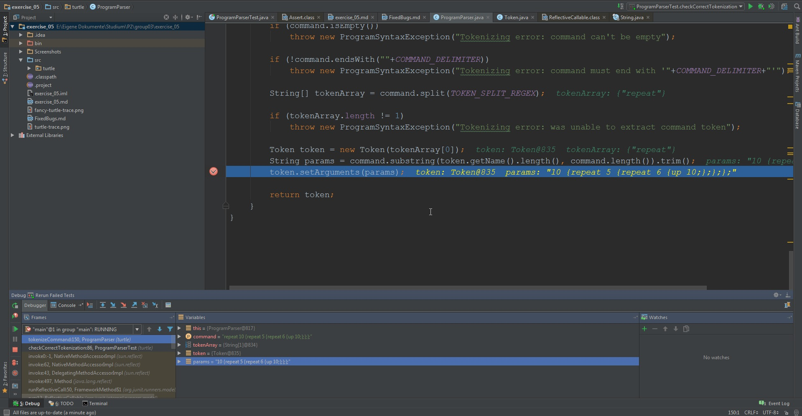
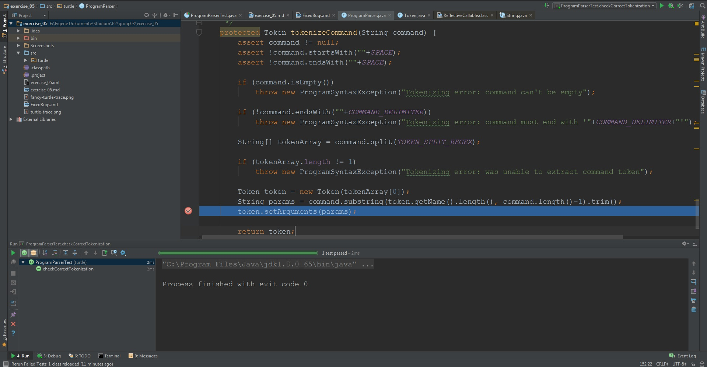

# Exercise 5

These are the required explanations how we used the debugger to fix the bugs.

## First Bug

This bug occurred in the *checkCorrectBrackets()* test method.
First I set a breakpoint before the parse call.

Then I stepped down throw the parse method until I discovered what was throwing the exception.

The problem was that the Stack wasn't popped when the program parsed a correct bracket.

So I fixed it by adding the pop method when a matching bracket is found.

## Second Bug
This bug occurred in the *testSplitThreeCommands()* test method.
Again I first set a breakpoint before the parse method is called

Then same as with first bug i stepped down throw the parse method until I discovered, that
the thrown exception came from a space before the command.

I fixed the bug by pushing the *blockStartIndex* to the first char that is not a space.

## Third Bug
This Bug occured in the *checkCorrectTokenization()* test method.
Same as with the first two bugs I first set a breakpoint (in fact, I set two breakpoints once
I realized where the problem occurred).

While stepping down I realized that the problem was that the *param* of the Tokens was different.
By comparing the values during debugging I discovered that in *TokenizeCommand()* is a semicolon
too many.

So I shortened the string by one, the char that is cut off is a semicolon because otherwise the user
failed the contract of the method. It's also necessary because we cut off the first command. Of course
then the last semicolon must be cut off as well.

---------

### The other Bugs

In BoardTest, the *testHorizontalTrace()* and *testVerticalTrace()* test methods fail, because
the methods *addHorizontalTrace()* and *addVerticalTrace()* in Board forget the start and end point.
Fixing this bug was easily setting the stepIndex to 0 and let it run till the distance and not stopping it one
before the distance. This fixed all bugs occurring in this TestClass.

In RepeatCommandTest, the *testRepeatOnceOneCommand()* method fails, because of an indexoutofboundexception.
This is caused because in BlockCommand, the superclass of the superclass, the method *extractArguments()*
splits the arguments in the part, that says how many times a command is repeated and the command.
The bug was that the splitting started at the Close bracket '}' and not at the Open bracket '{'.
Again this fixed all tests.

------------

#### The optional Bug

\-

