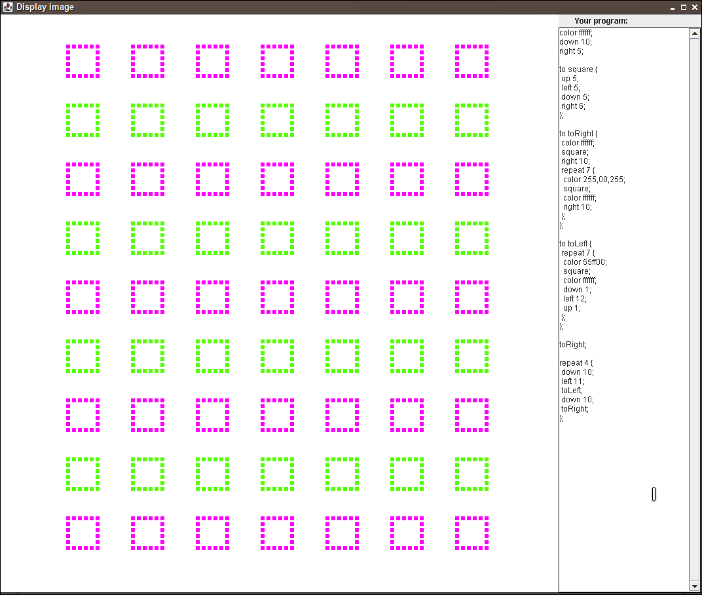

# Exercise 5

The fifth lecture is titled *Debugging and Tools* and covers more on 
test-driven development and how to work with the run-time stack and heap. Some 
practices and tools for debugging are presented, which is the subject of this 
exercise.

## Problem Description

This week, you are given an extended implementation of the Turtle game. Not 
only does it support all the features from exercise 3, it also adds great 
features such as colored traces, statements for repeating the same sequence a 
given number of times, and defining custom turtle commands.

Unfortunately, the programmer working on this extended implementation did not 
manage to finish on time. As a result, there are still quite a few bugs in the 
code. Fortunately, the programmer followed the TDD principles and wrote tests 
before finishing the implementation. This results in the program you start 
with, where several bugs are present which make certain tests fail.

Your task is to apply what you learned during the lecture by using a 
debugger to find and fix the bugs in the program. Since the program is rather 
large, you will probably run in a situation where you do not understand the 
code and have a hard time figuring out where something went wrong. 
Fortunately, a debugger can help in these situations. Since the emphasis in 
this exercise is on learning how to use a debugger, we ask you to show us how you 
worked with the debugger by providing screenshots. You need to show how you 
tackled a bug for at least 3 problems you encounter during this exercise.

In order to pass this exercise, you must meet the following requirements:

- You must make all the tests pass.
- You **must not** modify the source code of the tests! Changing the test so
  that it passes does not fix the bug!

- You must explain your work with the debugger in the following way:

  - Explain how the debugger helped you tackle a problem in a file
    called `debugger.md`, which must be in proper Markdown syntax, and
    should contain a textual explanation as well as screenshots (you
    should link to the screenshots using the corresponding markdown
    syntax). Do this for at least 3 different cases.

  - For each of these cases in which you used the debugger, describe the
    problem you were trying to solve, how you used the debugger, and how
    it did help you. Write a few sentences for each step.

Note that this exercise is more about the proper usage of a debugger and less
about finding the "best" solution for all bugs. That being said, aiming for a
proper solution is always a good idea.


## Turtle Language

This implementation of the turtle supports the following commands:

* `right n`
  * Moves the turtle to the right by `n` steps.

- `left n`
  - Moves the turtle to the left by `n` steps.

* `down n`
  * Moves the turtle down by `n` steps.

- `up n`
  - Moves the turtle up by `n` steps.

* `jump x y`
  * Moves the turtle to the specified coordinates on the board without
    leaving a trail.

- `color hex`
  - Changes the colour of the trace. `hex` is a hexadecimal value
    encoding a RGB value. For example, the command `color 00ff00;`
    changes the color of the trace to green.

- `color r,g,b`
  - Similarly, this command changes the color to the specified red,
    green, and blue values (`r`, `g`, `b` arguments). Each argument must
    be an integer in between 0 and 255. For example, the command `color
    0,0,255` changes the trace color to blue.

- `repeat n {
    commands
  }`
  - Repeats the sequence of commands `commands` for a number of `n`
    times. `commands` must be a valid sequence of commands.

- `to commandName {
    commands
  }`
  - Teaches the turtle the new command named `commandName` that can then
    be later used in the program. `commands` must be a valid sequence of
    commands.

The following is a valid example program utilizing these features:

```
to square {
  down 10;
  right 10;
  up 10;
  left 10;
};
repeat 5 {
  color 0,0,255;
  square;
  color ff0000;
  down 10;
  right 5;
};
```



## Notes and Hints

There are three classes (`ProgramParserTest`, `BoardTest`, `RepeatCommandTest`
containing 16 tests, all grouped into the suite `MainTestSuite`. We recommend
the following instructions for making the tests work (but of course you are
free to do this however you want, as long as you fulfill the requirements
mentioned above):

- The parser (class `ProgramParser`) uses an algorithm for checking if the 
  brackets are well balanced (similar to what was presented in one of the 
  previous lectures). However, it contains a bug. To fix this, start with the 
  test `checkCorrectBrackets` from `ProgramParserTest`. Make sure that the 
  test `checkIncorrectBrackets` also passes before moving on. Use the debugger 
  to find out how brackets are stored and managed.

- The commands from a program are separated using the character ';'. While 
  checking whether brackets are well balanced, the parser also splits the 
  input into individual commands based on the separator. Unfortunately, there 
  is a bug there as well. The first test you should take a look at is 
  `testSplitThreeCommands`. Use the debugger to understand how the parser is 
  splitting the input based on the separator. Make sure the test 
  `checkCorrectTokenization` also works. You should only move on to other 
  tests once these two are working.

- Five tests are failing in `BoardTest` due to two small bugs. The starting 
  points to fix these are `testVerticalTrace` and `testHorizontalTrace`. Using 
  the debugger, you can find out how the loops that mark squares are executed.

- All tests in `BlockCommand` fail. You should only attempt to fix these once 
  all the other tests succeed! You can start with `testRepeatOnceCommand`. Do 
  not forget to also take a look at the superclasses of `RepeatCommand` (a 
  breakpoint in `extractArguments` might be a good idea...).

## Optional Bug

There is one bug that is rather difficult to solve, which involves nested `to`
statements. Consider the following program:

```
to cat {
   to dog {
     right 10;
   };
   down 10;
   dog; };
cat;
```

The program defines a `cat` command which contains a nested definition of the
`dog` command. When executing `cat`, it works as we would expect: First `down
10` is executed, then `right 10`. However, there is a problem with the scope
of the nested definition if we do the following:

```
to cat {
   to dog {
     right 10;
   };
   down 10;
   dog; };
cat;
to dog {
  down 20; };
cat;
dog;
```

In this case, we first run `down 10` followed by `right 10` as before. But
since we redefine `dog` in the subsequent lines, the second execution of `cat`
results in running `down 10` followed by `down 20`! However, we would want to
keep the original definition of `dog` when it is executed from within `cat`,
but the new definition of `dog` when it is executed from outside.

Keep in mind that fixing this bug is harder than fixing the other ones and 
requires more work.


## Deadline

Submit your solutions by pushing your code to the git repository by
___Thursday, 14 April, 13:00___.
