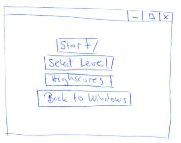
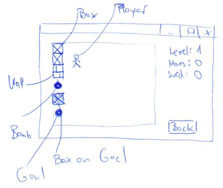
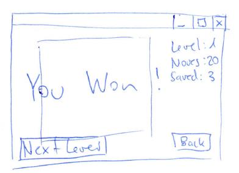
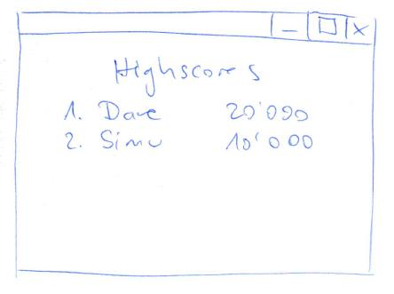

# Prototype

## Menu

The menu contains 4 buttons:

- The *Start button* to start the game from level 01

- The *Selcet Level* button to play only one level

- The *Hiscores* button to view the Highscores

- The *Back to Windows* button to quit the Game

## Play

This sketch shows the Windows during the game is played.
There are the *Level* which shows the current level, 
the *Moves* which shows how many moves you've made
and the *Saved* which shows how many boxes are already on a goal
There is also the *Back* button to go back to the menu
The player can move by using the arrow keys

## Winscreen

This screen is shown, if the player finishes the game.
There are two buttons:

- The *Back* button to go back to the menu

- The *Next Level* button to play the next level. This button is only shown if Start was selected in the menu

## Highscores

This window shows the Highcores made. How the Highscores will be calculated is yet to determin.
I forgot the *Back* button in the sketch below to go back to the menu

